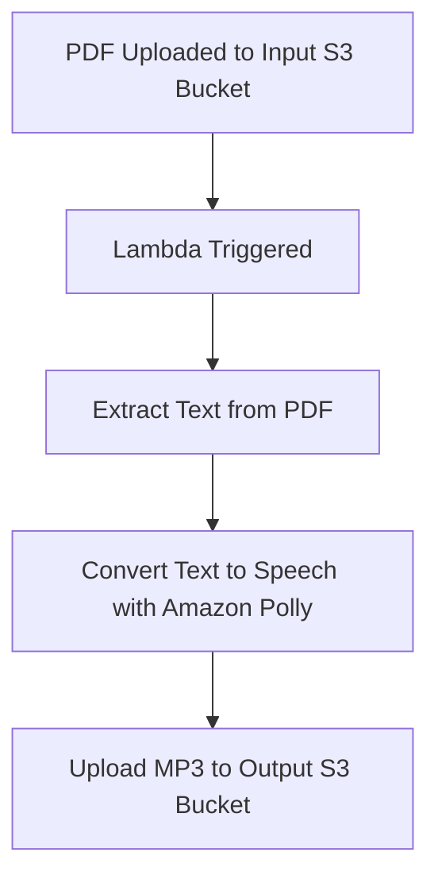

# pdf-to-audio-serverless using AWS

Convert uploaded PDF files to spoken audio automatically using AWS serverless technologies! 

## 📌 Overview

This project is a serverless application built on **AWS Lambda**, **Amazon S3**, and **Amazon Polly**. When a PDF is uploaded to a designated S3 bucket, the system automatically extracts the text, converts it to speech using Amazon Polly, and uploads the resulting audio file (MP3) to a different S3 bucket.

It's an automated pipeline for generating audio content from PDFs – perfect for accessibility tools, audio books, or voice-based summaries.

---

## 🧰 Technologies Used

- **AWS Lambda** – For event-driven processing
- **Amazon S3** – For storing input PDFs and output audio files
- **Amazon Polly** – To convert text to speech
- **Amazon Textract or PyMuPDF** – To extract text from PDF files
- **IAM Roles & Policies** – For securing resource access

---

## 🗂️ Architecture



---

## 🚀 Getting Started

### 1. 📁 Setup S3 Buckets

- **Input Bucket**: To receive PDF files.
- **Output Bucket**: Where MP3 audio files will be stored.

Example:
- `pdf-input-bucket`
- `audio-output-bucket`

### 2. 🛠️ Configure Lambda Function

The Lambda function should:
- Be triggered by an `ObjectCreated` event in the input bucket.
- Extract text from the uploaded PDF.
- Use Amazon Polly to synthesize speech.
- Upload the generated MP3 to the output bucket.

Ensure the Lambda has permission to:
- Read from the input bucket
- Write to the output bucket
- Call Amazon Polly

### 3. 🔐 IAM Role Example

```json
{
  "Effect": "Allow",
  "Action": [
    "s3:GetObject",
    "s3:PutObject",
    "polly:SynthesizeSpeech"
  ],
  "Resource": "*"
}
```

*(Adjust resource ARNs for better security practices.)*

---


## 📁 Example File Flow

1. Upload `document.pdf` to `pdf-input-bucket`.
2. Lambda extracts text and generates `document.mp3`.
3. `document.mp3` is saved in `audio-output-bucket`.

---

## 🧪 Sample Output

- Input: `article.pdf` (3 pages)
- Output: `article.mp3` (audio)
- Voice: Polly’s `Joanna` (customizable)

---

## 🧱 Folder Structure

```
pdf-to-audio/
├── lambda_function.py
└── README.md
```

---

## 💡 Features

- ✅ Fully serverless & scalable
- ✅ Supports any PDF with readable text
- ✅ Fast and cost-effective using Polly
- ✅ Easy integration with existing AWS workflows

---

## 📌 Use Cases

- 🔊 Audio books and accessibility tools
- 📚 Audio summaries for documents
- 🎓 Educational PDFs to voice notes

---


## 🛡️ License

This project is licensed under the [MIT License](LICENSE).

---

## 🙌 Acknowledgments

Thanks to the power of **AWS Lambda**, **Amazon S3**, and **Amazon Polly**, this project makes content more accessible through automation. 🧠🎧
```

---

Let me know if you'd like this tailored for a specific runtime (e.g., Python), or if you'd like deployment code or examples added!
